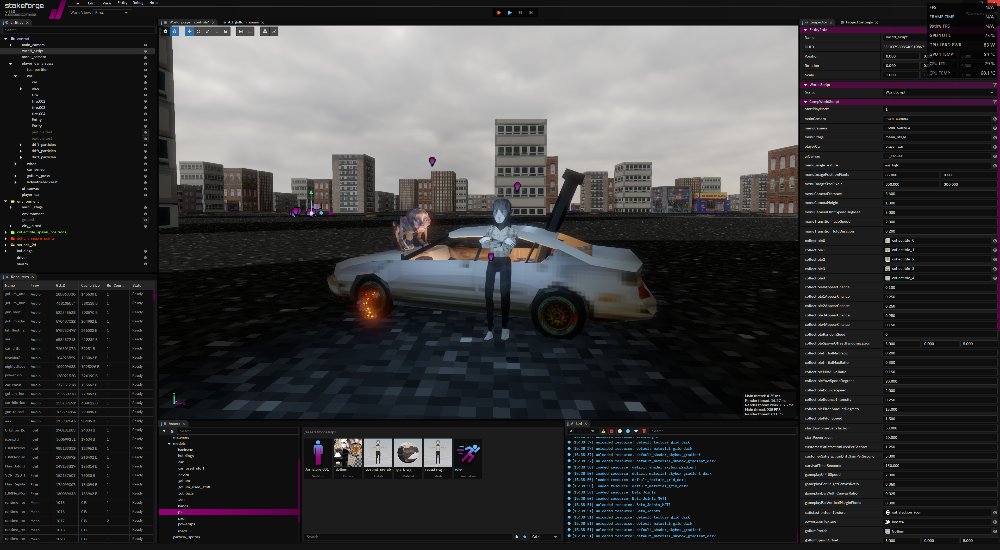
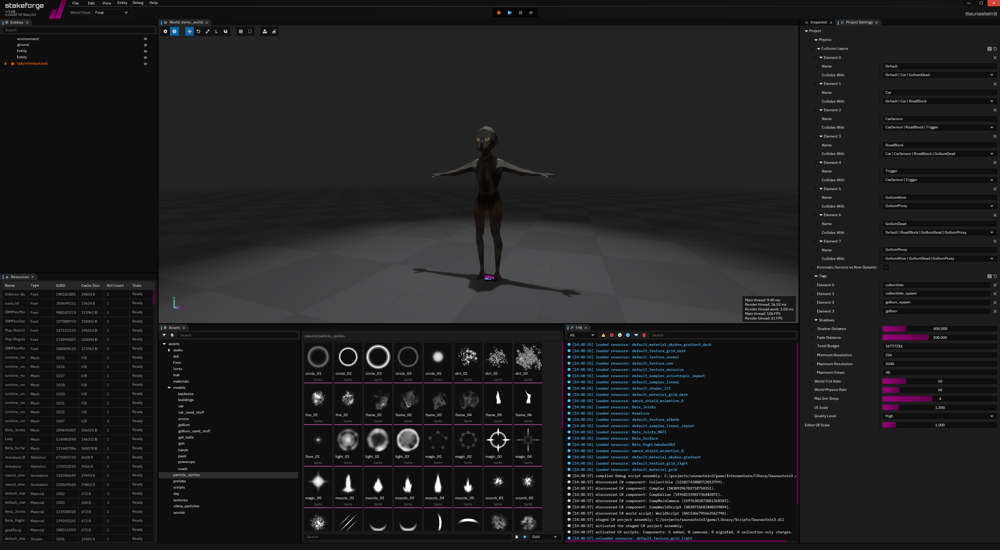
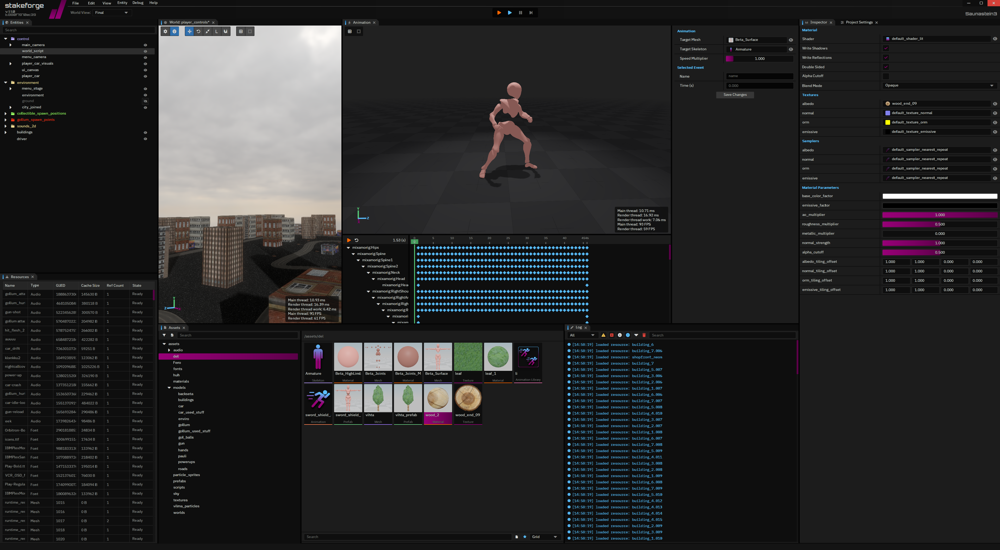
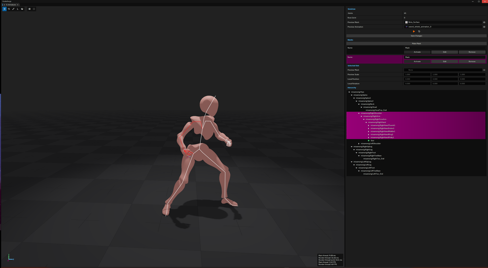
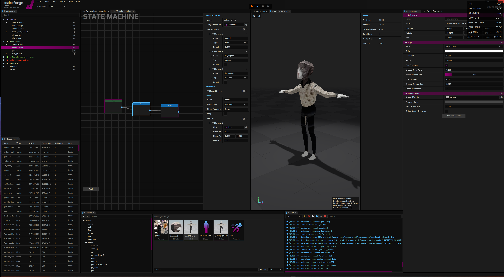

<div align="center">

# stakeforge

[](#licensing--attribution)


</div>

Stakeforge is my on-going engine project, successor to [Lina Engine](https://github.com/inanevin/LinaEngine). This is a project I develop & maintain in my personal time. PRs, discussions & contributions are always welcome. A stable release is planned for the last quarter of 2026.

This is new architecture of Stakeforge. Still a performance oriented C++ engine, now extended with a proper editor, asset workflows and scripting to make building games with it a little more comfortable :)

> [original compact engine Stakeforge 1 is preserved here](https://github.com/inanevin/stakeforge/releases/tag/v1.0.0), with its simpler, code-first approach to making games.

<div align="center">



[Saunastein 3: Beneath the Seat](https://kauheaa.itch.io/saunastein-3), made with Stakeforge v2 for Assembly Game Jam 2026. sauna car, drifting & gollums, go give it a try!

</div>

## the idea

The original Stakeforge had a pretty clear goal: a compact engine, minimal abstractions, very little editor, just get in there and make a game. I still like that version and wanted to keep it around as its own thing.

v2 grows that architecture with the tools I need while making games. The editor gives me a place to build worlds, inspect assets, set up animations and iterate on gameplay. Underneath it, the focus is still on data layout, cache utilization, predictable runtime behavior and keeping the engine fast.

- **performance**: data-oriented systems, contiguous storage, handles, pools and frame allocators. keeping runtime allocations and unnecessary copies down is still a core goal.
- focused platform support: Windows & DX12 for now, less time spent maintaining backends and more time spent on the engine and games.
- practical workflows: importing assets, cooking resources, hot-reloading and editing things while seeing what they actually look like.
- build what the games need. there is still plenty to do, but I want actual games to keep giving this project its direction.

## At the moment we have:

ok first of all a lot of stuff is still under development, couple compromises here and there that will be fixed, but;

### engine/runtime

- DoD entity & component storage, world hierarchies, prefabs and reflected component data.
- resource management with asset cooking, dependency tracking and hot-reloading.
- Jolt physics integration, rigid bodies, collision layers, queries and ragdolls.
- miniaudio based audio, including spatial audio.
- animation graphs with state machines, transitions, 1D/2D blending, joint masks and animation events.
- particle simulation and rendering, plus canvas/UI support for games.
- separate runtime and rendering work, fixed-step simulation with interpolation, frame-time tracking and memory tracking.
- Tracy integration for profiling, debug drawing, and a bunch of platform, input, math, serialization and memory utilities.

### rendering

pretty cute PBR renderer running on DX12 on Windows;

- deferred rendering with a depth prepass, bindless resources and clustered lighting.
- glTF metallic/roughness materials, normal maps, emissive materials and skinned meshes.
- directional, point, spot and area lights.
- directional cascaded shadows, point/spot shadows and PCF filtering.
- reflection probes with filtered specular reflections and diffuse irradiance from spherical harmonics.
- screen-space ambient occlusion, compute bloom, fog and skyboxes.
- tone mapping, exposure, saturation, FXAA and custom post-process passes.
- particles, debug views and game UI rendering.

### editor

- custom docking & widget system, world viewports, entity hierarchy and component inspectors.
- transform gizmos, multi-selection, undo/redo and prefab workflows.
- asset browser with thumbnails, material editing and resource inspection.
- mesh and skeleton viewers, joint hierarchy, joint masks and attachment slots.
- animation previews, event timelines, animation libraries and a visual animation graph editor.
- project settings, collision layer editing, play controls and project cooking.
- C# script compilation and reloading, with script component fields exposed in the inspector.

<div align="center">




world editing, assets, materials & animation previews.




skeletons, joint masks & animation graphs.

</div>

### a note on scripting

C# scripting is currently a **test case** for the gameplay workflow. It lets me try out script components, editor integration and iteration while making games with the engine.

I'm planning to **replace it fully with C++ scripting**. C# works, was a nice learning experience, but I just don't feel comfortable maintaining such a big scripting layer/environment. especially editor workflow, editor reflection and once I introduce C++ plugin system, I feel like not drowning under that.


## Misc

stuff is constantly under development, I am seeing what's needed on the way. [Saunastein 3](https://kauheaa.itch.io/saunastein-3) is already a game made with v2, and the idea is to keep making games alongside the engine. Please do hit up the discussions and issues! the foundation is still changing, but getting there gracefully :)

### building/project

CMake based build system, using C++23. Currently Windows/MSVC only, with DX12 and Shader Model 6.6 or newer required for rendering.

You'll need a recent Visual Studio C++ toolchain with the Windows SDK, **CMake 4.0+**, and the **.NET 10 x64 SDK** for the current C# script host.

From the repository root:

```sh
cmake -S . -B _build
cmake --build _build --config Release
```

The editor is built to `_build/bin/Release/stakeforge_editor.exe`. Debug and Profile configurations are available too.

### vendor

- [fmt](https://github.com/fmtlib/fmt)
- [lz4](https://github.com/lz4/lz4)
- [phmap](https://github.com/greg7mdp/parallel-hashmap)
- [Jolt Physics](https://github.com/jrouwe/JoltPhysics)
- [stb](https://github.com/nothings/stb)
- [moodycamel](https://github.com/cameron314/concurrentqueue)
- [miniaudio](https://github.com/mackron/miniaudio)
- [json](https://github.com/nlohmann/json)
- [tinygltf](https://github.com/syoyo/tinygltf)
- [FreeType](https://freetype.org/)
- [KTX-Software](https://github.com/KhronosGroup/KTX-Software)
- [Tracy](https://github.com/wolfpld/tracy)
- [DirectX Shader Compiler](https://github.com/microsoft/DirectXShaderCompiler)
- [PIX](https://devblogs.microsoft.com/pix/)

Bundled libraries keep their own licenses and notices.

## licensing & attribution

Stakeforge's first-party code is licensed under **GNU GPL version 3, with the Stakeforge Game Linking Exception**. Make games, sell them, keep your game and your engine changes private. If you distribute a derived engine or a general-purpose game-making tool, that work needs to stay open under GPLv3.

| What you ship | What source you need to share |
| --- | --- |
| A game made with the downloaded editor | None |
| A game made with an editor you compiled yourself | None |
| A game using your modified engine | None, including your engine changes |
| A derived engine, SDK, general-purpose editor or game-making tool | The corresponding source required by GPLv3 |

So basically, if you distribute a derived engine or general-purpose development tool, you must make its corresponding source available to recipients as GPLv3 requires and retain the Stakeforge attribution and required notices. 

For a game, you don't need to bundle engine source, host it, offer it on request, or provide anything for rebuilding or relinking. Your independently authored game code and assets can stay proprietary. This covers static and dynamic linking, prebuilt runtimes, modified runtimes, and ordinary use of public API headers. You don't need to ship the editor either.

That permission covers the engine binaries shipped with the game and its qualifying modding tools. If you choose to distribute Stakeforge source, keep its required licenses and notices. Third-party libraries may still require their own notices, even in games; this exception doesn't waive those.


### the license

Copyright (c) 2025-2026 Inan Evin.

Stakeforge is licensed under the GNU General Public License, version 3, with the additional permissions in GAME-LINKING-EXCEPTION.md. It comes without a warranty.

- [GNU General Public License, version 3](LICENSE) — the full, unmodified license.
- [Stakeforge Game Linking Exception, version 1.0](GAME-LINKING-EXCEPTION.md) — the additional permission for shipping games.
